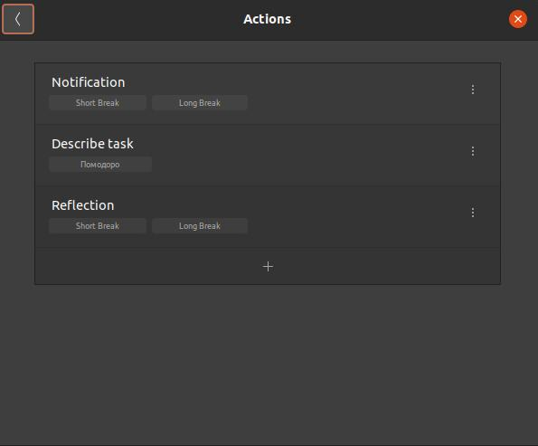
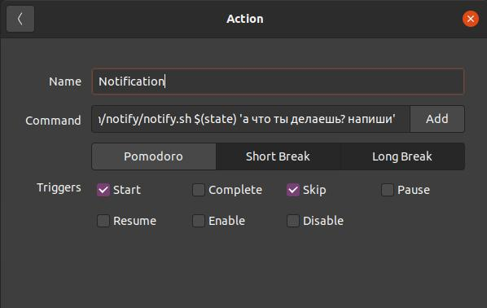
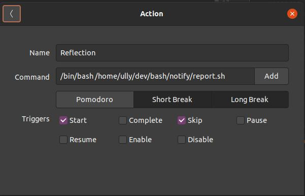

## Кастомные действия для Gnome Pomodoro Timer
0. установить для pomodoro custom actions  

1. Напомнить про перерыв на подумать `/bin/bash /home/ully/dev/bash/notify/notify.sh $(state) 'а что ты делаешь? напиши'`    

2. `/bin/bash /home/ully/dev/bash/notify/notify.sh Задача 'описать задачу'  ||  /bin/bash /home/ully/dev/bash/notify/report.sh `    

3. Открыть файл с отчетом `/bin/bash /home/ully/dev/bash/notify/report.sh`  
